# Console Luau SDK

> A powerful and elegant terminal output library for Luau/Lune with rich formatting, syntax highlighting, and interactive components.

[](https://opensource.org/licenses/MIT)
[](https://github.com/lune-org/lune)

---

## 📦 Installation

### Option 1: Install via Git Clone (Recommended)

Clone the repository directly into your project:

```bash
# Navigate to your project directory
cd YourProject

# Clone the Console SDK
git clone https://github.com/yanlvl99/console-lune-sdk.git Console
```

This will create the following structure:

```
YourProject/
├── Console/
│   ├── Components/
│   ├── Highlighter/
│   ├── StreamWriter/
│   ├── Utils/
│   └── init.luau
├── .luaurc
└── your_script.luau
```

**Configure the alias** in your `.luaurc`:

```json
{
  "aliases": {
    "Console": "./Console"
  }
}
```

### Option 2: Manual Installation

Alternatively, you can manually download and copy the `Console` package to your project's directory:

1. Download the package from [GitHub](https://github.com/yanlvl99/console-lune-sdk)
2. Extract and place it in your project
3. Configure the alias as shown above

---

## 🚀 Quick Start

```lua
local Console = require("@Console")

-- Logging with colors
Console.success("Server started successfully!")
Console.error("Connection failed")
Console.warn("Low memory warning")
Console.info("Processing request...")

-- Syntax highlighted code blocks
Console.code([[
fun main() {
    println("Hello, Kotlin!")
}
]], "kotlin")

-- Interactive components
Console.table({ name = "John", age = 30 }, "User Info")
Console.progress(75, 100)
```

---

## 📚 API Reference

### Logging Functions

Professional logging methods with semantic colors and prefixes.

#### Methods

| Method | Description | Color |
|--------|-------------|-------|
| `Console.success(message: string)` | Success message with `[OK]` prefix | Green |
| `Console.error(message: string)` | Error message with `[X]` prefix | Red |
| `Console.warn(message: string)` | Warning message with `[!]` prefix | Yellow |
| `Console.info(message: string)` | Info message with `[i]` prefix | Cyan |
| `Console.debug(message: string)` | Debug message with `[?]` prefix | Gray |
| `Console.log(message: string)` | Standard log message | White |

#### Example

```lua
Console.success("Operation completed successfully!")
Console.error("An error occurred during processing")
Console.warn("This action might be dangerous")
Console.info("Server is listening on port 3000")
Console.debug("Variable value: x = 42")
Console.log("Standard log message")
```

#### Preview

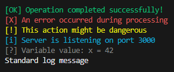

---

### Text Colors

Apply colors to text strings for inline formatting.

#### Methods

| Method | Color |
|--------|-------|
| `Console.red(text: string)` | Red |
| `Console.green(text: string)` | Green |
| `Console.yellow(text: string)` | Yellow |
| `Console.blue(text: string)` | Blue |
| `Console.magenta(text: string)` | Magenta |
| `Console.cyan(text: string)` | Cyan |
| `Console.white(text: string)` | White |
| `Console.gray(text: string)` | Gray |

#### Example

```lua
print(Console.red("Error: ") .. "Something went wrong")
print(Console.green("Success: ") .. "File saved")
print(Console.cyan("Info: ") .. "Processing...")
```

#### Preview

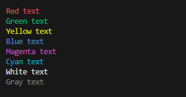

---

### Text Styles

Apply typographic styles to text (bold, italic, underline, etc.).

#### Methods

| Method | Style |
|--------|-------|
| `Console.bold(text: string)` | **Bold** text |
| `Console.italic(text: string)` | *Italic* text |
| `Console.underline(text: string)` | <u>Underlined</u> text |
| `Console.dim(text: string)` | Dimmed text |
| `Console.strikethrough(text: string)` | ~~Strikethrough~~ text |

#### Example

```lua
print(Console.bold("Important Notice"))
print(Console.italic("Note: This is experimental"))
print(Console.underline("Click here"))
print(Console.dim("Additional info"))
```

#### Preview

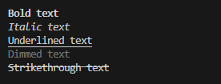

---

### Syntax Highlighting

Display code blocks with syntax highlighting for 16+ programming languages.

#### Method

```lua
Console.code(code: string, language: string?)
```

#### Supported Languages

| Language | Aliases | Example |
|----------|---------|---------|
| Lua/Luau | `lua`, `luau` | Keywords, strings, functions |
| Python | `python`, `py` | Indentation-aware |
| JavaScript | `javascript`, `js`, `typescript`, `ts` | Modern syntax |
| **Kotlin** ⭐ | `kotlin`, `kt` | Data classes, coroutines |
| **C#** ⭐ | `csharp`, `cs`, `c#` | LINQ, async/await |
| **Swift** ⭐ | `swift` | Optionals, protocols |
| Java | `java` | Classes, interfaces |
| C/C++ | `c`, `cpp`, `c++` | Pointers, templates |
| Go | `go`, `golang` | Goroutines |
| Rust | `rust`, `rs` | Ownership syntax |
| Ruby | `ruby`, `rb` | Symbols, blocks |
| PHP | `php` | Web scripting |
| Bash | `bash`, `sh`, `shell` | Shell commands |
| SQL | `sql` | Queries |
| HTML | `html` | Tags, attributes |
| CSS | `css` | Properties, selectors |

⭐ = Recently added with full support

#### Color Scheme

- **Keywords**: Purple (`fun`, `class`, `if`, `return`)
- **Strings**: Pink (`"text"`, `'text'`)
- **Numbers**: Orange (`42`, `3.14`)
- **Functions**: Teal (`functionName()`)
- **Comments**: Gray (`// comment`)
- **Identifiers**: White

#### Example - Lua

```lua
Console.code([[
local function greet(name)
    local message = "Hello, " .. name
    print(message)
    return true
end

for i = 1, 10 do
    if i % 2 == 0 then
        print("Even: " .. i)
    end
end
]], "lua")
```

#### Preview

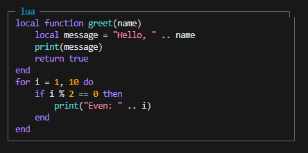

#### Example - Kotlin

```lua
Console.code([[
fun greet(name: String) {
    val message = "Hello, $name"
    println(message)
}

data class Person(val name: String, val age: Int)

fun main() {
    for (i in 1..10) {
        when {
            i % 2 == 0 -> println("Even: $i")
        }
    }
}
]], "kotlin")
```

#### Preview

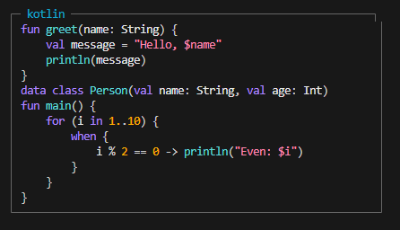

#### Example - C#

```lua
Console.code([[
using System;

public class Program {
    public static async Task Main() {
        var name = "World";
        Console.WriteLine($"Hello, {name}!");
        
        await Task.Delay(1000);
    }
}
]], "csharp")
```

#### Preview

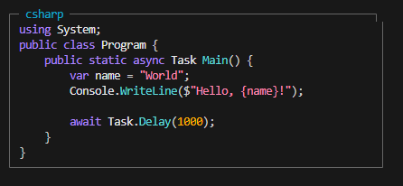

#### Example - Swift

```lua
Console.code([[
func greet(name: String) {
    let message = "Hello, \(name)"
    print(message)
}

struct Person {
    let name: String
    var age: Int
}

for i in 1...10 {
    guard i % 2 == 0 else { continue }
    print("Even: \(i)")
}
]], "swift")
```

#### Preview

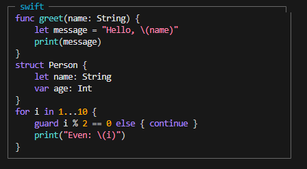

---

### Headers & Dividers

Create visual separators and section headers.

#### Methods

| Method | Description |
|--------|-------------|
| `Console.header(title: string, char: string?)` | Styled header with dividers |
| `Console.divider(char: string?, length: number?)` | Horizontal line separator |

#### Example

```lua
Console.header("Application Settings")
Console.divider()
print("Setting 1: Value")
print("Setting 2: Value")
Console.divider("=", 50)
```

#### Preview

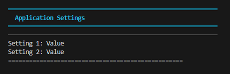

---

### Box Component

Display text in a bordered box.

#### Method

```lua
Console.box(text: string, padding: number?)
```

#### Example

```lua
Console.box("Welcome to Console API!\nThis is a boxed message.")
```

#### Preview

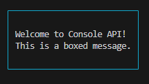

---

### Lists

Display bulleted and numbered lists.

#### Methods

| Method | Description |
|--------|-------------|
| `Console.list(items: {string}, bullet: string?)` | Bulleted list |
| `Console.numbered(items: {string})` | Numbered list |

#### Example

```lua
-- Bulleted list
Console.list({ 
    "First item", 
    "Second item", 
    "Third item" 
})

-- Numbered list
Console.numbered({ 
    "Step one", 
    "Step two", 
    "Step three" 
})
```

#### Preview

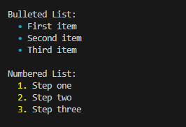

---

### Tables

Display key-value data in a formatted table.

#### Method

```lua
Console.table(data: {[string]: any}, title: string?)
```

#### Example

```lua
Console.table({
    name = "John Doe",
    age = 30,
    email = "john@example.com",
    active = true,
}, "User Information")
```

#### Preview

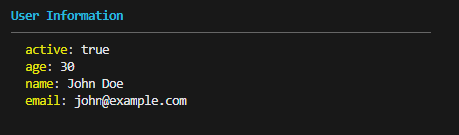

---

### Progress Bar

Display progress with a visual bar indicator.

#### Method

```lua
Console.progress(current: number, total: number, width: number?)
```

#### Example

```lua
for i = 0, 100, 10 do
    Console.progress(i, 100, 50)
    -- Simulate work
    print() -- Move to next line
end
```

#### Preview

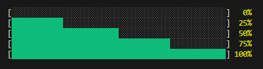

---

### Markdown Rendering

Render markdown text with colors and formatting.

#### Method

```lua
Console.markdown(text: string)
```

#### Supported Markdown

- **Headings**: `#`, `##`, `###`
- **Bold**: `**text**`
- **Italic**: `*text*`
- **Code**: `` `code` ``
- **Lists**: `- item` or `1. item`
- **Blockquotes**: `> quote`
- **Horizontal Rules**: `---`
- **Links**: `[text](url)`

#### Example

```lua
Console.markdown([[
# Main Heading
## Subheading

This is **bold** text and this is *italic* text.

- Bullet point one
- Bullet point two

1. Numbered item
2. Another item

`inline code here`

> This is a blockquote

---

[Link text](https://example.com)
]])
```

#### Preview

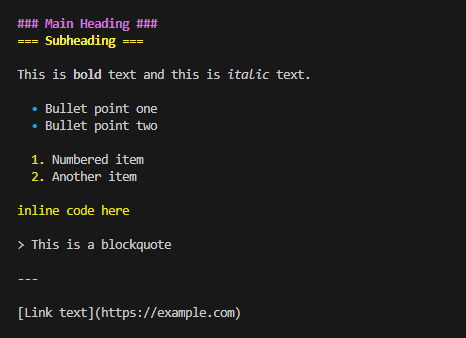

---

### Spinner

Animated loading spinner (returns a controller object).

#### Method

```lua
Console.spinner(frames: {string}?, interval: number?)
```

#### Example

```lua
local spinner = Console.spinner()
-- Do work...
-- Stop spinner when done
```

---

### Input Functions

Interactive user input prompts.

#### Methods

| Method | Description | Returns |
|--------|-------------|---------|
| `Console.input(label: string, default: string?)` | Text input | `string` |
| `Console.confirm(label: string)` | Yes/No confirmation | `boolean` |
| `Console.select(label: string, options: {string})` | Single choice | `number` |
| `Console.multiselect(label: string, options: {string})` | Multiple choices | `{number}` |

#### Example

```lua
local name = Console.input("Enter your name:", "Guest")
local confirmed = Console.confirm("Are you sure?")
local choice = Console.select("Choose an option:", {"Option A", "Option B", "Option C"})
```

---

### Terminal Control

Low-level terminal manipulation.

#### Methods

| Method | Description |
|--------|-------------|
| `Console.clear()` | Clear entire terminal |
| `Console.clearLine()` | Clear current line |
| `Console.moveCursor(row: number, col: number)` | Move cursor to position |
| `Console.saveCursor()` | Save cursor position |
| `Console.restoreCursor()` | Restore cursor position |
| `Console.hideCursor()` | Hide cursor |
| `Console.showCursor()` | Show cursor |
| `Console.write(text: string)` | Write without newline |
| `Console.writeln(text: string)` | Write with newline |
| `Console.newline(count: number?)` | Print empty lines |

---

### Advanced Formatting

Custom color and style combinations.

#### Method

```lua
Console.format(text: string, color: string?, style: string?, bgColor: string?)
```

#### Example

```lua
local formatted = Console.format("Important!", "red", "bold", "yellow")
print(formatted)
```

---

### Configuration

Configure global Console behavior.

#### Method

```lua
Console.configure({
    boxedCode: boolean?,
    syntaxHighlighting: boolean?,
    boxWidth: number?
})
```

#### Example

```lua
Console.configure({
    boxedCode = true,           -- Show code in boxes
    syntaxHighlighting = true,  -- Enable syntax colors
    boxWidth = 80              -- Set box width
})
```

---

### StreamWriter

Create a streaming writer for real-time output (useful for AI responses).

#### Method

```lua
Console.createStreamWriter(config: StreamConfig?): StreamWriter
```

#### StreamConfig

```lua
type StreamConfig = {
    boxedCode: boolean?,
    syntaxHighlighting: boolean?,
    boxWidth: number?
}
```

#### Example

```lua
local writer = Console.createStreamWriter({
    syntaxHighlighting = true,
    boxedCode = true
})

-- Stream text chunks
writer:write("Hello ")
writer:write("World!")
writer:finish()
```

---

## 🎨 Color Reference

### Standard ANSI Colors

`black`, `red`, `green`, `yellow`, `blue`, `magenta`, `cyan`, `white`

### Bright Colors

`brightBlack`, `brightRed`, `brightGreen`, `brightYellow`, `brightBlue`, `brightMagenta`, `brightCyan`, `brightWhite`

### Custom RGB Colors (8-bit)

| Color | Use Case | Code |
|-------|----------|------|
| `purple` | Keywords in syntax highlighting | `\27[38;5;141m` |
| `orange` | Numbers in syntax highlighting | `\27[38;5;214m` |
| `pink` | Strings in syntax highlighting | `\27[38;5;211m` |
| `teal` | Function names | `\27[38;5;80m` |
| `lime` | Type annotations | `\27[38;5;155m` |
| `gold` | Constants | `\27[38;5;220m` |
| `sky` | Class names | `\27[38;5;117m` |
| `coral` | Operators | `\27[38;5;209m` |
| `gray` | Comments | `\27[38;5;245m` |

---

## 📖 Complete Example

```lua
local Console = require("@Console")

-- Configure
Console.configure({
    syntaxHighlighting = true,
    boxedCode = true
})

-- Application header
Console.header("My Application v1.0")
Console.newline()

-- Logging
Console.info("Starting server...")
Console.success("Server started on port 3000")

-- Display user data
Console.table({
    username = "john_doe",
    email = "john@example.com",
    role = "admin",
    active = true
}, "User Profile")

-- Show code example
Console.code([[
fun authenticate(user: String, pass: String): Boolean {
    return database.verify(user, pass)
}
]], "kotlin")

-- Progress simulation
Console.info("Loading resources...")
for i = 0, 100, 20 do
    Console.progress(i, 100)
    print()
end
Console.success("Resources loaded!")

-- Footer
Console.divider()
Console.log("Application ready!")
```

---

## 🛠️ Requirements

- **Lune** 0.8.0 or higher
- **Luau** type checking support

---

## 📝 License

MIT License - See LICENSE file for details

---

## 👤 Author

**yanlvl99_**
- Discord: [@yanlvl99_](https://discord.com/channels/@me/1222190313204879421)

---

## 🤝 Contributing

Contributions are welcome! Please feel free to submit a Pull Request.

---

**Made with ❤️ for the Luau community**
